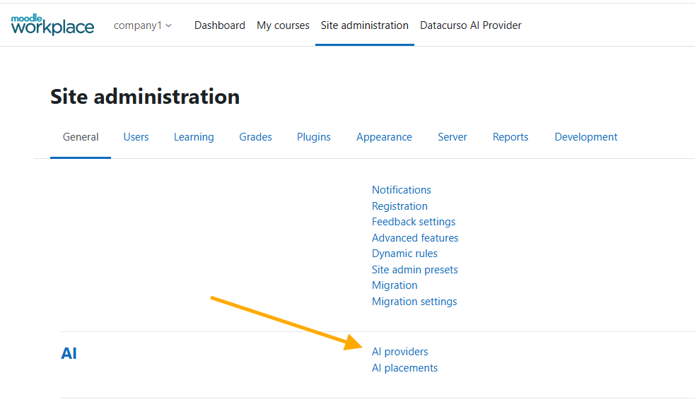
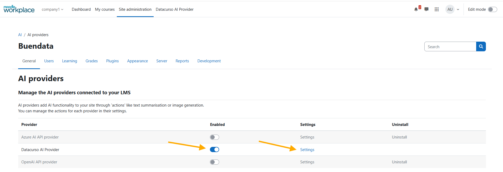
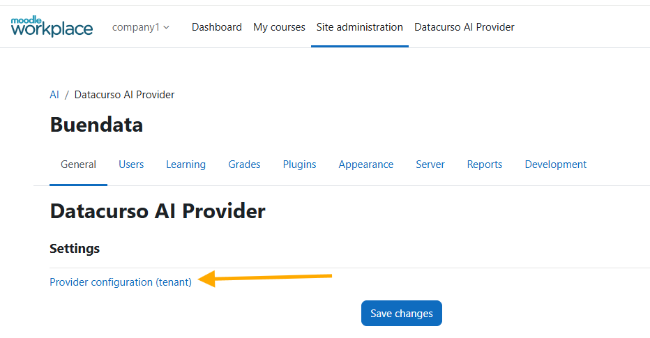
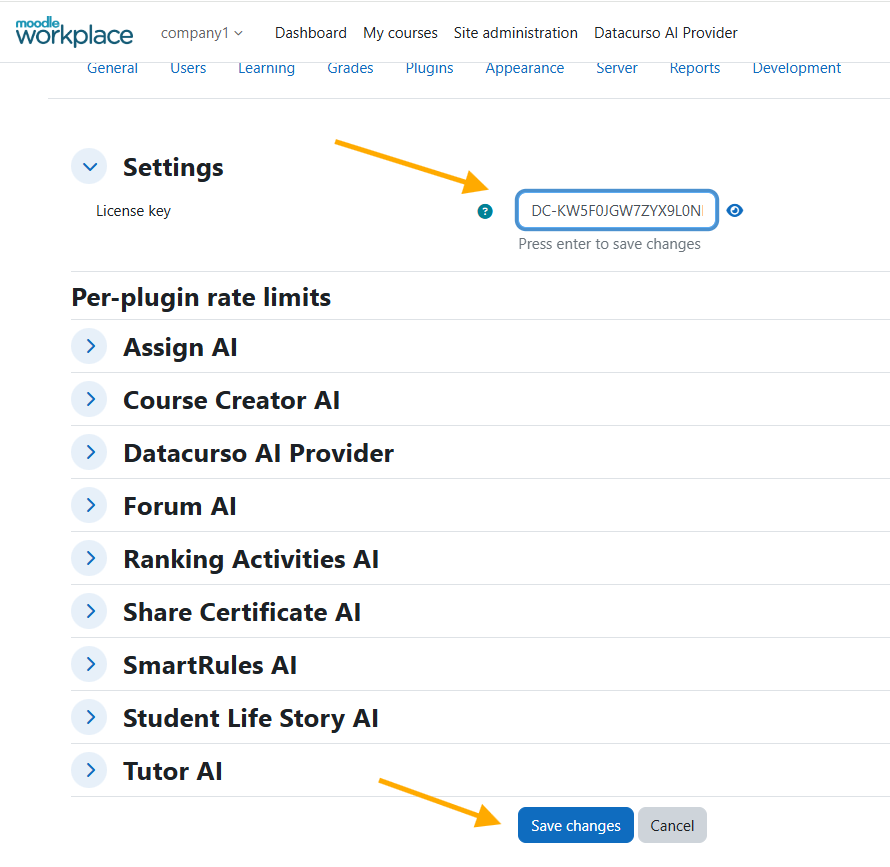
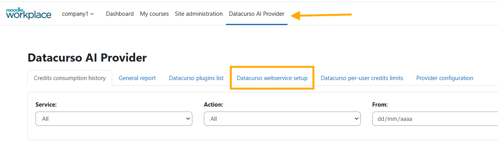
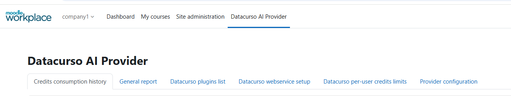
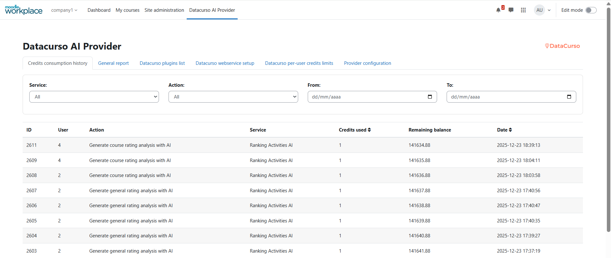
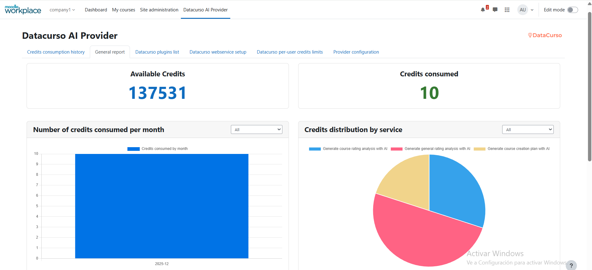
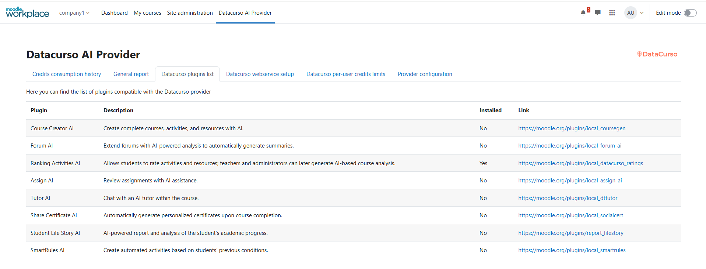
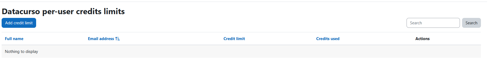

# Datacurso AI Provider for Moodle Workplace 4.5

The **Datacurso AI Provider** is the core engine that connects Moodle with the **Datacurso AI services** — unlocking a full ecosystem of smart, AI-powered plugins designed to revolutionize online learning.

This provider serves as the central bridge that powers every Datacurso AI extension, enabling a new generation of intelligent features for teachers, students, and administrators.

In addition, the **Datacurso AI Provider** includes built-in capabilities to display **detailed AI credit usage reports** directly within Moodle.  
Administrators can easily monitor and manage AI service consumption through visual dashboards showing:

- **Number of credits consumed per month**
- **Available credits**
- **Total credits consumed**
- **Credit distribution by service**
- **Daily credit usage trends**

## The Datacurso AI Plugin Suite

Transform Moodle into a **smarter, faster, and more engaging learning platform** with the **Datacurso AI Plugin Suite** — a collection of next-generation tools that bring artificial intelligence directly into your LMS.  
All plugins in this suite are powered by the **Datacurso AI Provider**.

### Explore the Suite

- **[Ranking Activities AI](https://moodle.org/plugins/local_datacurso_ratings)**
  Empower students to rate course activities while AI analyzes feedback and provides deep insights to educators.

- **[Forum AI](https://moodle.org/plugins/local_forum_ai)**  
  Introduce an AI assistant into your forums that contributes to discussions and keeps engagement alive.

- **[Assign AI](https://moodle.org/plugins/local_assign_ai)**  
  Let AI review student submissions, suggest feedback, and support teachers in the grading process.

- **[Share Certificate AI](https://moodle.org/plugins/local_socialcert)**  
  Celebrate achievements automatically! AI generates personalized social media posts when students earn certificates.

- **[Student Life Story AI](https://moodle.org/plugins/report_lifestory)**  
  Gain a complete view of student performance with AI-generated summaries across all enrolled courses.

- **[Course Creation AI](https://moodle.org/plugins/local_coursegen)**  
  Build full Moodle courses in minutes — complete with lessons, activities, and resources — guided by AI.

## Powering Moodle’s Built-In AI Features

Beyond the Datacurso suite, the **AI Provider** also enables Moodle’s **native AI features**, enhancing creativity and productivity across your entire platform:

- **Generate Text** – Create meaningful content from any prompt.  
- **Generate Image** – Produce original images from text descriptions.  
- **Summarize Text** – Quickly generate concise summaries from course content.

## Pre-requisites

1. Tener minimo la version 4.5 de moodle
2. Adquirir un paquete de creditos de AI desde el [shop de DataCurso](https://shop.datacurso.com/index.php?m=tokens_manager) y crear una llave de licencia tal como se indica en la seccion [Obtener llaves de licencia](#obtener-llaves-de-licencia)

## Installing via uploaded ZIP file

1. Log in to your Moodle site as an admin and go to `Site administration > Plugins > Install plugins`.
2. Upload the ZIP file with the plugin code. You should only be prompted to add
   extra details if your plugin type is not automatically detected.
3. Check the plugin validation report and finish the installation.

## Installing manually

The plugin can be also installed by putting the contents of this directory to

```
{your/moodle/dirroot}/ai/provider/datacurso
```

Afterwards, log in to your Moodle site as an admin and go to `Site administration > Notifications` to complete the installation.

Alternatively, you can run

```bash
php admin/cli/upgrade.php
```

to complete the installation from the command line.

## Testing locally (cURL settings)

If you plan to test from a local environment, adjust Moodle’s cURL security settings so the provider and its dependent plugins can make HTTP requests:

1. In the site administration search box, type "curl" and open the page that shows cURL/HTTP security settings.
2. In the first field `cURL blocked hosts list`, remove any registered IP addresses or host entries.
3. In the second field `cURL allowed ports list`, add the port where your local Moodle is running (for example: `8000`).

These Moodle security settings directly affect the Datacurso AI Provider and, therefore, the functionality of any plugins that depend on it.


## Getting license keys

1. Sign in or create an account on the [shop DataCurso](https://shop.datacurso.com)
2. Go to the **Manage AI Credits** section
   
   

3. Click on the **BUY MORE CREDITS** button
   
   
   
4. Select the package of credits you want to acquire
   
   

5. Once the credits are acquired, the new balance will be displayed
   
   

6. To create a license key, we enter the **My Licenses** section and click the **Create License** button
   
   

7. In the confirmation window that appears, click the **Create** button
   
   
   
8. Once the license key is created, we can assign credits to use it in moodle. Click the **Assign Credits** button

   

9.  In the confirmation window that appears, enter the amount of credits you want to assign to the license key and click the **Confirm Assignment** button
   

10. Once the credits are assigned, we can copy the license key to use it in moodle as indicated in the [Plugin Configuration](#plugin-configuration) section
    
    

**Note:** We can create several license keys and assign different amounts of credits to use them in different moodle sites.

## Plugin Configuration

1. Log in to your Moodle site as an admin and go to `Site administration > General > AI > AI Providers`.
   
   

2. Enable the **Datacurso AI Provider** and click on **Settings**

   

3. Enter the following settings:

   - **Link configuration provider of tenant**: Enter the link configuration tenant

   

4. Configure the settings:

   - **License key**: Enter the license key that we copied in the [Obtain License Keys](#obtain-license-keys) section

   

### ⚠️IMPORTANT: 

This configuration only applies to the tenant in which it is configured. In this example, this provider configuration is applied and saved only in the Company1 tenant.


## Datacurso AI Provider 

In this section we will find global reports and configurations from our provider.




## Datacurso webservice setup

### ⚠️IMPORTANT: 

Without completing this setup, the following Datacurso AI plugins will not function correctly in your Moodle site:

- Forum AI: [https://docs.datacurso.com/index.php?title=Forum_AI](https://docs.datacurso.com/index.php?title=Forum_AI)
- Assign AI: [https://docs.datacurso.com/index.php?title=Assign_AI](https://docs.datacurso.com/index.php?title=Assign_AI)
- Tutor AI: [https://docs.datacurso.com/index.php?title=Tutor_AI](https://docs.datacurso.com/index.php?title=Tutor_AI)

You can find more information about these plugins in their respective documentations.

### Description

This feature allows you to automatically configure the Web Service used by Datacurso to fetch contextual information from your platform and improve AI responses.

### What it does:
- Enables Web services and the **REST** protocol if they are not already active.
- Creates or reuses the service user `datacursows`.
- Creates or reuses the `Datacurso web service` role and assigns it to the user at the system context with the required capabilities.
- Creates or reuses the external service `Datacurso web service`, enables it, and restricts it to authorized users.
- Adds default functions to the service (for example, `core_course_get_contents`, `mod_assign_get_submissions`).
- Authorizes the user to use the external service.
- Generates (or reuses) a permanent token for the user/service.
- Registers the site in Datacurso by securely sending the token.

#### Role capabilities configured

The following capabilities are configured for the `Datacurso web service` role:

- `webservice/rest:use`
- `moodle/category:viewhiddencategories`
- `moodle/course:enrolreview`
- `moodle/course:view`
- `moodle/course:viewhiddencourses`
- `moodle/course:viewhiddensections`
- `moodle/course:viewparticipants`
- `moodle/course:viewhiddenactivities`
- `mod/forum:viewdiscussion`
- `mod/forum:viewqandawithoutposting`
- `mod/wiki:viewpage`
- `mod/glossary:view`
- `mod/book:read`
- `mod/lesson:view`
- `mod/choice:choose`
- `mod/choice:readresponses`
- `mod/feedback:view`
- `mod/feedback:viewanalysepage`
- `mod/scorm:viewreport`
- `mod/scorm:viewscores`
- `mod/h5pactivity:view`
- `mod/h5pactivity:reviewattempts`
- `mod/resource:view`
- `mod/page:view`
- `mod/assign:view`
- `mod/assign:viewgrades`
- `mod/data:viewentry`
- `mod/data:view`
- `mod/folder:view`
- `mod/label:view`
- `mod/url:view`
- `mod/workshop:view`

#### Web service functions enabled for AI context

The following functions are added to the `Datacurso web service` external service:

- `core_course_get_contents`
- `core_course_get_courses_by_field`
- `mod_forum_get_forums_by_courses`
- `mod_forum_get_forum_discussions`
- `mod_forum_get_discussion_posts`
- `mod_wiki_get_wikis_by_courses`
- `mod_wiki_get_subwikis`
- `mod_wiki_get_subwiki_pages`
- `mod_wiki_get_page_contents`
- `mod_wiki_get_subwiki_files`
- `mod_glossary_get_glossaries_by_courses`
- `mod_glossary_get_entries_by_search`
- `mod_glossary_get_entry_by_id`
- `mod_book_get_books_by_courses`
- `mod_lesson_get_lessons_by_courses`
- `mod_lesson_get_pages`
- `mod_lesson_get_page_data`
- `mod_choice_get_choices_by_courses`
- `mod_choice_get_choice_options`
- `mod_choice_get_choice_results`
- `mod_feedback_get_feedbacks_by_courses`
- `mod_feedback_get_items`
- `mod_feedback_get_finished_responses`
- `mod_feedback_get_analysis`
- `mod_scorm_get_scorms_by_courses`
- `mod_scorm_get_scorm_scoes`
- `mod_scorm_get_scorm_user_data`
- `mod_scorm_get_scorm_sco_tracks`
- `mod_h5pactivity_get_h5pactivities_by_courses`
- `mod_h5pactivity_get_attempts`
- `mod_h5pactivity_get_results`
- `mod_resource_get_resources_by_courses`
- `mod_resource_view_resource`
- `mod_page_get_pages_by_courses`
- `mod_assign_get_assignments`
- `mod_assign_view_assign`
- `mod_assign_get_submission_status`
- `mod_data_get_databases_by_courses`
- `mod_data_get_entries`
- `mod_data_get_fields`
- `mod_folder_get_folders_by_courses`
- `mod_folder_view_folder`
- `mod_label_get_labels_by_courses`
- `mod_url_get_urls_by_courses`
- `mod_url_view_url`
- `mod_workshop_get_workshops_by_courses`
- `mod_workshop_view_workshop`
- `mod_workshop_get_submissions`

### Interface:
- Shows the current status (web services/REST, user, role, service, token, registration).
  
  

- Buttons: **Configure webservice** (configure everything), **Retry** (retry registration/send), **Regenerate token** (regenerate token and resend registration).
  
  

- Includes a live activity log with the steps performed.

   

- Si el proceso de registro sale bien nos deberia aparecer algo como lo siguiente:

   

## Actions

From the same configuration page of the **Datacurso AI Provider**, you can enable and customize the following Moodle AI-powered actions, seamlessly integrated with Moodle’s native capabilities:

- **Generate Text** – Create meaningful content from any prompt.  
- **Generate Image** – Produce original images from text descriptions.  
- **Summarize Text** – Quickly generate concise summaries from course content.


## Reports Datacurso AI Provider

In this section you can monitor credit usage in detail for each action performed in each plugin of the Datacurso suite, including totals, trends, and distribution by service.

To view the reports, go to `Site administration > Datacurso AI Provider`.



### History Consumption Credits 

Here we can see three sections. The first section shows the credit consumption history for AI usage in plugins that use the Datacurso provider, as well as the predefined AI actions in Moodle.



### Reports grafics

The second section displays information about credit usage through visual graphs.




### Datacurso List Plugins

The third section shows the list of Datacurso plugins that are compatible with the Datacurso AI provider.



### Datacurso per-user credits limits

This section is for create credits limits of use AI per user.



### Provider configuration

This section is the settings provider of tenant.

## License ##

2025 Data Curso LLC <https://datacurso.com>

This program is free software: you can redistribute it and/or modify it under
the terms of the GNU General Public License as published by the Free Software
Foundation, either version 3 of the License, or (at your option) any later
version.

This program is distributed in the hope that it will be useful, but WITHOUT ANY
WARRANTY; without even the implied warranty of MERCHANTABILITY or FITNESS FOR A
PARTICULAR PURPOSE.  See the GNU General Public License for more details.

You should have received a copy of the GNU General Public License along with
this program.  If not, see <https://www.gnu.org/licenses/>.
